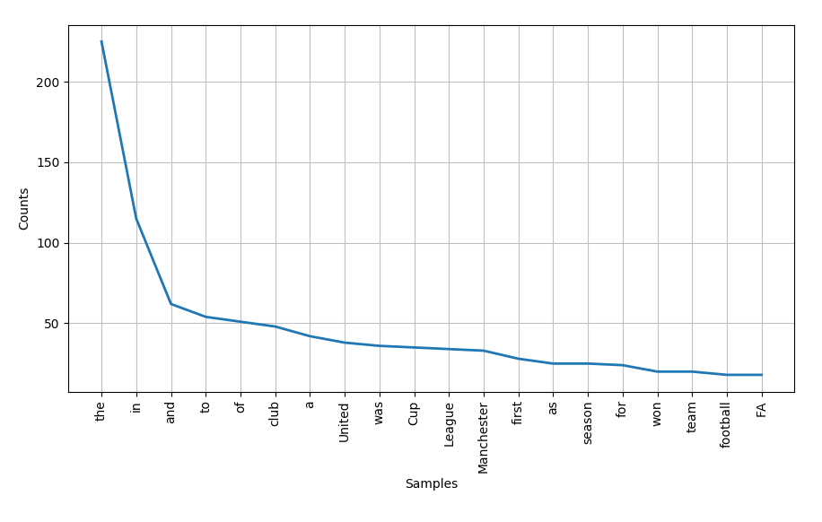
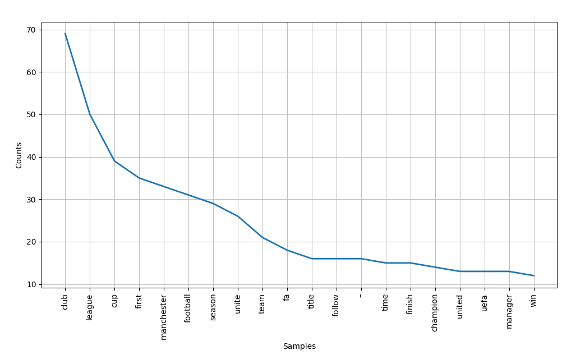
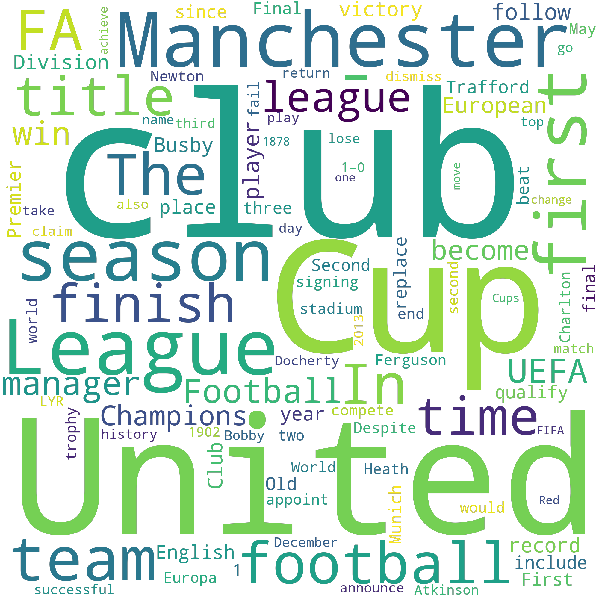

# NLP with Python

---

## What is NLP?

> Natural language processing (NLP) is a subfield of linguistics and artificial intelligence concerned with the interactions between computers and human languages, in particular how to program computers to process and analyze large amounts of natural language data.

-- Wikipedia

---

## Real world examples

- Information Extraction: Gmail structures events from emails
- Text Simplification: Rewordify simplifies the meaning of sentences
- Question Answering: IBM Watson’s winning Jeopardy
- Spam filters: Google's spam filters understand what’s inside the email content and see if it’s a spam or not.

---

## What is Text Analytics?

Text communication is one of the most popular forms of day to day conversion, we chat, message, tweet, share status...

Text Analytics can help us understand what has been written and has lots of applications in today's online world. For example by analyzing tweets on Twitter, we can find trending news and peoples reaction on a particular event.

---

## NLTK

### Natural Language Toolkit

> NLTK is a leading platform for building Python programs. It provides easy-to-use interfaces and lexical resources such as WordNet, along with a suite of text processing libraries for classification, tokenization, stemming, tagging...

### Pre processing

To make understanding of content easier, cleaning of the dataset can be performed.

---

### Our Data

Trust is the foundation of the BBC; we are independent, impartial and honest. Audiences are at the heart of everything we do. We take pride in delivering quality and value for money. Creativity is the lifeblood of our organisation. We respect each other and celebrate our diversity. We are one BBC; great things happen when we work together.

---

### Punctuation

```python
from string import punctuation

translator = str.maketrans('', '', punctuation)
output = text.translate(translator)
```

### Output

> Trust is the foundation of the BBC we are independent impartial and honest Audiences...

---

### Word Tokenization

```python
from nltk.tokenize import word_tokenize

tokenized_word = word_tokenize(text)
print(tokenized_word)
```

### Output

['Trust', 'is', 'the', 'foundation', 'of', 'the', 'BBC', ';', 'we', 'are', 'independent', ',', 'impartial', 'and', 'honest' ... ]

---

### Stopwords

```python
from nltk.corpus import stopwords

stop_words = set(stopwords.words("english"))

for w in tokenized_word:
    if w not in stop_words:
        filtered_sent.append(w)
```

### Output

['Trust', 'foundation', 'BBC', ';', 'independent', ',', 'impartial', 'honest', '.', 'Audiences', 'heart', 'everything' ...]

---

### Stemming

```python
from nltk.stem import PorterStemmer

ps = PorterStemmer()

for w in filtered_sent:
    stemmed_words.append(ps.stem(w))
```

### Output

['trust', 'foundat', 'bbc', ';', 'independ', ',', 'imparti', 'honest', '.', 'audienc', 'heart', 'everyth' ...]

---

### POS Tagging

```python
from nltk import pos_tag

for w in tokenized_word:
    if w not in stop_words:
        filtered_sent.append(w)

pos_tag(filtered_sent)
```

### Output

[('Trust', 'NNP'), ('foundation', 'NN'), ('BBC', 'NNP'), (';', ':'), ('independent', 'JJ'), ...]

---

### Lemmatizing

```python
from nltk.stem.wordnet import WordNetLemmatizer

lem = WordNetLemmatizer()

for w in filtered_sent:
    lemmatized_words.append(lem.lemmatize(w))
```

### Output

['We', 'one', 'BBC', ';', 'great', 'thing', 'happen', 'work', 'together', ...]

---

## Putting it all together

- Strip Punctuation
- Word Tokenization
- Strip Stopwords
- POS Tagging
- Lemmatizing

---

### Example

> Manchester United Football Club is a professional football club based in Old Trafford, Greater Manchester, England, that competes in the Premier League, the top flight of English football. Nicknamed "the Red Devils", the club was founded as Newton Heath LYR Football Club in 1878, changed its name to Manchester United in 1902 and moved to its current stadium, Old Trafford, in 1910...

---

### Before processing



---

### After processing



_Most Common Words_:
club, United, Cup, League, Manchester, season, first, team, football, FA, title, time, finish...

<br/>
Total Adjectives: 169
Total Nouns: 1030
Total Adverbs: 50
Total Verbs: 257

---



---

## Sentiment Analysis

### Using Machine Learning

---

### Dataset

---

### Feature Generation using Bag of Words

---

### Split train and test set

---

### Model Building and Evaluation

---

### Accuracy

Recall Precision etc
graphs

---

### Improve things
