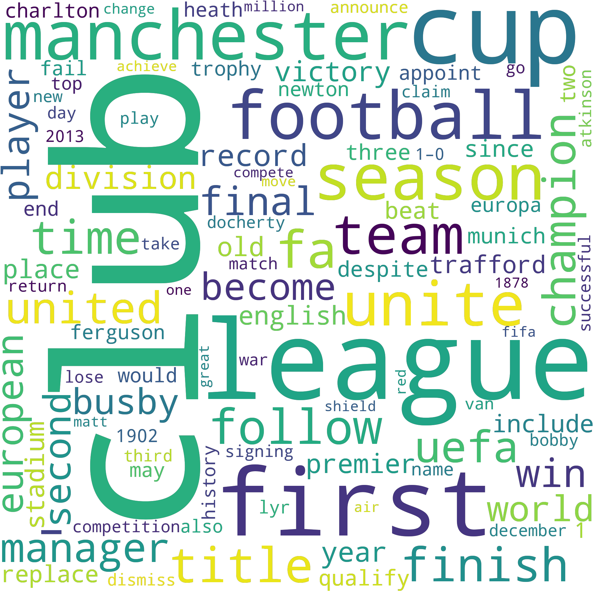

# NLP with Python

---

## What is NLP?

> Natural language processing (NLP) is a subfield of linguistics and artificial intelligence concerned with the interactions between computers and human languages, in particular how to program computers to process and analyze large amounts of natural language data.

-- Wikipedia

---

## Real world examples

- Information Extraction: Gmail structures events from emails
- Text Simplification: Rewordify simplifies the meaning of sentences
- Question Answering: IBM Watson’s winning Jeopardy
- Spam filters: Google's spam filters understand what’s inside the email content and see if it’s a spam or not.

---

## What is Text Analytics?

Text communication is one of the most popular forms of day to day conversion, we chat, message, tweet, share status...

Text Analytics can help us understand what has been written and has lots of applications in today's online world. For example by analyzing tweets on Twitter, we can find trending news and peoples reaction on a particular event.

---

## Natural Language Toolkit

> NLTK is a leading platform for building Python programs. It provides easy-to-use interfaces and lexical resources such as WordNet, along with a suite of text processing libraries for classification, tokenization, stemming, tagging...

### Pre processing

To make understanding of content easier, cleaning of the dataset can be performed.

---

### Our Data

Trust is the foundation of the BBC; we are independent, impartial and honest. Audiences are at the heart of everything we do. We take pride in delivering quality and value for money. Creativity is the lifeblood of our organisation. We respect each other and celebrate our diversity. We are one BBC; great things happen when we work together.

---

### Punctuation

```python
from string import punctuation

translator = str.maketrans('', '', punctuation)
output = text.translate(translator)
```

### Output

> Trust is the foundation of the BBC we are independent impartial and honest Audiences...

---

### Word Tokenization

```python
from nltk.tokenize import word_tokenize

tokenized_word = word_tokenize(text)
print(tokenized_word)
```

### Output

> ['Trust', 'is', 'the', 'foundation', 'of', 'the', 'BBC', ';', 'we', 'are', 'independent', ',', 'impartial', 'and', 'honest' ... ]

---

### Stopwords

```python
from nltk.corpus import stopwords

stop_words = set(stopwords.words("english"))

for w in tokenized_word:
    if w not in stop_words:
        filtered_sent.append(w)
```

### Output

> ['Trust', 'foundation', 'BBC', ';', 'independent', ',', 'impartial', 'honest', '.', 'Audiences', 'heart', 'everything' ...]

---

### Stemming

```python
from nltk.stem import PorterStemmer

ps = PorterStemmer()

for w in filtered_sent:
    stemmed_words.append(ps.stem(w))
```

### Output

> ['trust', 'foundat', 'bbc', ';', 'independ', ',', 'imparti', 'honest', '.', 'audienc', 'heart', 'everyth' ...]

---

### POS Tagging

```python
from nltk import pos_tag

for w in tokenized_word:
    if w not in stop_words:
        filtered_sent.append(w)

pos_tag(filtered_sent)
```

### Output

> [('Trust', 'NNP'), ('foundation', 'NN'), ('BBC', 'NNP'), (';', ':'), ('independent', 'JJ'), ...]

---

### Lemmatizing

```python
from nltk.stem.wordnet import WordNetLemmatizer

lem = WordNetLemmatizer()

for w in filtered_sent:
    lemmatized_words.append(lem.lemmatize(w))
```

### Output

> ['We', 'one', 'BBC', ';', 'great', 'thing', 'happen', 'work', 'together', ...]

---

## Putting it all together

- Strip Punctuation
- Word Tokenization
- Strip Stopwords
- POS Tagging
- Lemmatizing

---

### Sample Data

> Manchester United Football Club is a professional football club based in Old Trafford, Greater Manchester, England, that competes in the Premier League, the top flight of English football. Nicknamed "the Red Devils", the club was founded as Newton Heath LYR Football Club in 1878, changed its name to Manchester United in 1902 and moved to its current stadium, Old Trafford, in 1910...

---

### Before processing


---

### After processing


_Most Common Words_:
club, United, Cup, League, Manchester, season, first, team, football, FA, title, time, finish...

<br/>
Total Adjectives: 169
Total Nouns: 1030
Total Adverbs: 50
Total Verbs: 257

---



---

## Sentiment Analysis

### Using Machine Learning

---

### Dataset

Our dataset for this was downloaded from Figure Eight, who provide several free to use datasets, in this case we are using a Airline Twitter Sentiment one. This consists of approx 16000 rows of Tweets mentioning major US airlines. The data was scraped in February 2015 and where classified as either Postive, Neutral or Negative.

---

### Samples

> :smile: @VirginAmerica So excited for my first cross country flight LAX to MCO I've heard nothing but great things about Virgin America. #29DaysToGo
> <br/>
> :neutral_face: @USAirways please hold 3923! I can see it. Just can't get off my first plane quick enough
> <br>
> :angry: @USAirways you are horrendous. Pull your shit together

---

### Feature Generation using Bag of Words

Bag-of-words (BoW) model is the simplest way to extract features from our text source. BoW converts our text into a matrix desrcibing the occurence of these words. For our matrix we are using a single word, but it is possible to use a combination of more words.

```python
cv_bow = CountVectorizer(lowercase=True, ngram_range = (1,1))
text_cv_bow = cv_bow.fit_transform(new_data_set)
```

---

### Split train and test set

To help us train our model `scikit-learn` has a function called `train_test_split`, this allows us to split our dataset into training and test data. Our data below is being split 80/20, 80% for training, 20% for test.

```python
training_data, test_data, training_labels, test_labels = train_test_split(
    text_cv_bow,
    input_sentiments,
    test_size=0.2,
    random_state=1)
```

---

### Model Building and Evaluation

We now need to build and train our model with the dataset we've just created. For this we're going to use the Multinomial Naive Bayes classifier, other classifiers are available.

```python
mnb = MultinomialNB()
model = mnb.fit(training_data, training_labels)
predictions_mnb = model.predict(test_data)
```

---

### Accuracy

For our first run through we managed to get an accuracy rating of: 0.7568306010928961. Not bad, but not great either.

|          | precision | recall | f1-score | support |
| -------- | --------- | ------ | -------- | ------- |
| negative | 0.77      | 0.94   | 0.85     | 1826    |
| neutral  | 0.65      | 0.39   | 0.49     | 611     |
| positive | 0.78      | 0.52   | 0.63     | 491     |

---

### Where it struggles

75% accurarcy isn't great, its a bit meh really, so where's it falling down?

- We've not preprocessed our data set to clean it up
- Negative sentiment appears to be easy to detect
- More of a grey area between Neutral and Positive

---

### Fixing the problems

If we enable data sanitization and remove any neutral sentiments we can get a significant improvement in accuracy: 0.9112169770463404

|          | precision | recall | f1-score | support |
| -------- | --------- | ------ | -------- | ------- |
| negative | 0.92      | 0.97   | 0.95     | 1837    |
| positive | 0.87      | 0.67   | 0.76     | 472     |

---

## Lets try this with our own tweets!

So now that we have a more accurate model, lets try throwing some of our own tweets at it! Our model should then tell us whether it's positive or negative.

I've also enabled two other classifiers for this: BernoulliNB and ComplementNB, so we can see any differences. All have been trained on the same dataset.

---

## @BritishAirways y u lyin?

_MultinomialNB_: negative
_BernoulliNB_: negative
_ComplementNB_: negative

---

## @AmericanAir hey I’m 24 hours before a flight and got an email to check in and I can’t check in on the site. The button to check in is not there.

_MultinomialNB_: negative
_BernoulliNB_: negative
_ComplementNB_: negative

---

## @UnitedAirline @united thank you for your help today! You’ve saved my day!

_MultinomialNB_: positive
_BernoulliNB_: negative
_ComplementNB_: positive

---

## The customer care and response rate of @flyethiopian is really wanting and totally frustrating!!!

_MultinomialNB_: negative
_BernoulliNB_: negative
_ComplementNB_: negative

---

## @TKHelpDesk Great, thank you looking forward to visiting Turkey for the first time

_MultinomialNB_: positive
_BernoulliNB_: positive
_ComplementNB_: positive

---

# Thank You!
